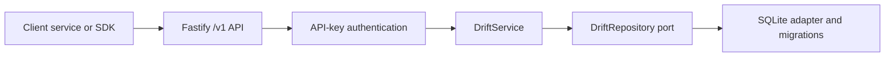

# Drift Architecture

## Purpose

Drift is a tenant-safe persistence service for connected application data. It makes a graph-shaped domain model boring in the best way: create a thing, connect it to another thing, retrieve it predictably, and keep storage replaceable.

Drift is not a graph database protocol, a hosted SaaS, a workflow engine, an identity provider, or an arbitrary code execution environment.

## Request flow and boundaries

HTTP handlers validate strict transport input, authenticate a Bearer key, and call `DriftService`. The service enforces tenancy, scopes, versions, graph integrity, deletion behavior, traversal limits, and retrieval limits. Core modules also execute traversal and declarative retrieval algorithms. The SQLite adapter only maps records and executes repository queries, including the narrow connected-edge lookup required by core traversal.

This separation is the portability seam: a Postgres or another storage adapter may replace SQLite only by preserving the `DriftRepository` behavior and its contract tests. It must not change core service rules or public API behavior.

Drift currently uses direct SQLite queries because they keep the adapter's storage work explicit. An ORM or query builder is a future adapter implementation decision, not an architectural boundary: adopting one must not place traversal, retrieval, authorization, or domain rules back into storage code.

See [implementing a storage adapter](./docs/explanation/adapters.md) for the repository contract, required behavior, and compatibility checklist for a future adapter.

## Identity and tenant boundary

An API key contains a random prefix and secret. The database stores only a derived cryptographic hash of the secret. The complete secret is returned once when a key is created or rotated; it cannot be recovered later.

Every authenticated request derives its tenant from the key. Clients never supply `tenantId` in a graph request.

| Scope   | Permission                                                                             |
| ------- | -------------------------------------------------------------------------------------- |
| `read`  | Read active graph records, lists, traversal, and retrieval results.                    |
| `write` | Create and mutate graph records.                                                       |
| `admin` | Includes read/write; manages tenant keys, reads deleted records, and restores records. |

Tenant creation and the first admin key are operator actions through the CLI. Each successful bootstrap creates one new, uniquely slugged tenant and that tenant's first admin key; it does not add a key to an existing tenant. An admin key can manage keys only inside its own tenant. See [tenants, bootstrap, and API keys](./docs/explanation/tenancy-and-api-keys.md) for the full lifecycle.

## Persisted model

Drift has four first-release tables. IDs are UUIDv7 strings. Timestamps are UTC ISO-8601 strings. SQLite stores JSON values as validated JSON text.

### Tenants

| Field                    | Meaning                                     |
| ------------------------ | ------------------------------------------- |
| `id`                     | Stable internal tenant identifier.          |
| `slug`                   | Unique, human-readable operator identifier. |
| `name`                   | Display name.                               |
| `status`                 | Tenant lifecycle state.                     |
| `createdAt`, `updatedAt` | Audit timestamps.                           |

### API keys

| Field                     | Meaning                                                     |
| ------------------------- | ----------------------------------------------------------- |
| `id`                      | Stable key record identifier.                               |
| `tenantId`                | Tenant that owns this credential.                           |
| `label`                   | Operator-provided description, such as `inventory-service`. |
| `prefix`                  | Non-secret lookup prefix included in the raw key.           |
| `secretHash`              | Stored hash of the secret; never returned by the API.       |
| `scopes`                  | `read`, `write`, and/or `admin`.                            |
| `lastUsedAt`, `revokedAt` | Operational metadata for use and revocation.                |

### Vertices

Vertices are domain things: customers, assets, devices, services, documents, jobs, or any other application entity.

| Field                    | Meaning                                                       |
| ------------------------ | ------------------------------------------------------------- |
| `id`                     | Stable UUIDv7 identifier.                                     |
| `tenantId`               | Owning tenant; always enforced by the service.                |
| `type`                   | Domain kind, for example `device` or `service`.               |
| `slug`                   | Optional human-friendly identifier.                           |
| `externalId`             | Optional identifier from an imported or integrated system.    |
| `title`                  | Optional display label.                                       |
| `status`                 | Common lifecycle state; defaults to `active`.                 |
| `data`                   | Flexible application payload: any valid JSON value.           |
| `metadata`               | Flexible system/control payload: any valid JSON value.        |
| `version`                | Optimistic-lock value required by PATCH, DELETE, and restore. |
| `createdAt`, `updatedAt` | Record timestamps.                                            |
| `deletedAt`              | Non-null only after soft deletion.                            |

### Edges

Edges are typed relationships between two vertices in the same tenant.

| Field                                                                         | Meaning                    |
| ----------------------------------------------------------------------------- | -------------------------- |
| `id`, `tenantId`, `type`, `status`, `data`, `metadata`, `version`, timestamps | Same roles as on a vertex. |
| `fromVertexId`                                                                | Source endpoint.           |
| `toVertexId`                                                                  | Destination endpoint.      |

An active edge may only connect two active vertices in its tenant. Deleting a vertex atomically soft-deletes its active incident edges. Restoring a vertex does not restore its edges; each edge must be explicitly restored after both endpoints are active.

## Read and mutation behavior

Lists provide type/status filters, edge endpoint filters, a deterministic ID-based cursor, and a bounded page size. Normal reads exclude deleted records. Only admins can request `includeDeleted=true`.

All PATCH and DELETE requests include the current integer `version`. A stale, missing, or already-deleted record causes a `409 Conflict`; successful mutation increments the version. This protects clients from overwriting one another.

Traversal is intentionally constrained: a caller provides a start vertex, direction (`in`, `out`, or `both`), optional edge and returned-vertex type filters, maximum depth, and result limit. Server limits are authoritative.

Retrieval is a synchronous, declarative alternative to lists and traversal. It can scan tenant vertices or edges, apply first-class type, status, and ID filters, project fields (including explicit `data.*` or `metadata.*` paths), group, aggregate, sort, and limit results. It cannot execute caller code, join sources, traverse within a pipeline, filter/group by arbitrary JSON paths, persist outputs, or create jobs.

The retrieval pipeline is `source → filter → projection → group → aggregate → sort/limit → response`. It is intentionally ETL/MapReduce-shaped without becoming executable MapReduce: the service maps persisted records to projected rows and reduces groups with standard operators, but it never accepts functions, writes derived records, or schedules work. Server defaults cap traversal at depth `5` and `500` results; retrieval at `5,000` scanned records, `1,000` groups, `1,000` rows, and a cooperative `250 ms` execution budget. See [the retrieval explanation](./docs/explanation/retrieval.md) for the complete process and operator semantics.

## Public contract and errors

The stable contract begins at `/v1`. The service returns a consistent error envelope with a machine-readable code and human message. Expected outcomes include `401` invalid/missing credentials, `403` insufficient scope, `404` missing active record, `409` stale/conflicting mutation, and `422` bounded-query rejection. The live OpenAPI document is available at `/v1/openapi.json`.

Detailed routes and request examples are in the [API reference](./docs/reference/api.md); field definitions for API consumers are in the [model reference](./docs/reference/model.md).
