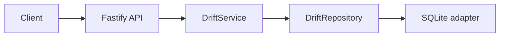

# Drift Architecture

Drift is a durable, resource-oriented persistence service for connected application data. Its HTTP API is versioned at `/v1`; all tenant identity derives from a scoped API key.

Vertices represent things and edges represent tenant-safe relationships. Both carry flexible JSON data, optimistic-lock versions, and soft-delete timestamps. Deleting a vertex soft-deletes its active incident edges in the same transaction.

The core has no Fastify or SQLite dependency. SQLite owns migrations and SQL, allowing another adapter to implement the same repository port later. Read access supports lists, constrained traversal, and synchronous declarative retrieval; retrieval never executes client code or persists derived data.
