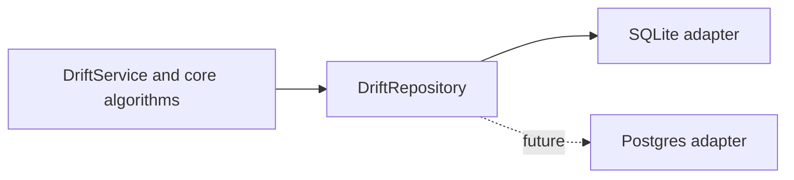

# Why Drift uses storage adapters

Use this explanation when deciding where persistence behavior belongs or evaluating a new storage technology. Drift is designed so storage can change without changing graph behavior. A storage adapter implements the `DriftRepository` interface in `src/interfaces/repository.ts`; SQLite is the first adapter, while a future Postgres adapter must preserve the same observable contract.

## The boundary

The core owns tenancy, authorization, optimistic concurrency policy, graph traversal, and declarative retrieval. An adapter owns persistence:

- map database rows to Drift records and records to storage values;
- execute repository reads, writes, transactions, and connected-edge lookups;
- apply that storage system's migrations and indexes; and
- translate storage-specific failures only when the repository contract requires it.

An adapter must not introduce a second definition of Drift rules. In particular, it must not implement traversal loops, retrieval projection/grouping/aggregation, scope checks, or API-key authorization policy.

## Required repository behavior

An adapter must implement every member of `DriftRepository`, including tenant and API-key persistence, vertex/edge CRUD, soft deletion/restoration writes, filtered list reads, and `findConnectedEdges`.

The port has two intentional shapes:

1. **Record operations** persist or retrieve one tenant-scoped record at a time. They use the supplied tenant ID and never infer it from client input.
2. **Persistence primitives** support core algorithms without embedding them. `findConnectedEdges` returns edges adjacent to a supplied frontier according to direction, edge-type, and deleted-record filters. Core traversal decides how often to call it, how to build the next frontier, and how to limit results.

List methods must preserve the documented filters, deterministic ID ordering, opaque cursor behavior, page boundaries, and deleted-record handling. Update and delete methods must honor the supplied version atomically, returning `null` when the expected active record/version does not match. The service translates that outcome into the public conflict response.

## Adapter-specific choices

An adapter may use direct SQL, a query builder, or an ORM. That is an implementation decision inside the adapter, not a change to the core boundary.

The SQLite adapter separates its own concerns:

- `repository.ts` translates `DriftRepository` calls to adapter components;
- `graph-store.ts` contains reusable SQL query mechanics;
- `mappers.ts` converts SQLite rows and patch fields; and
- `migrations.ts` creates tables and indexes.

A new adapter should use an equally clear internal structure. Do not expose its ORM models, SQL query objects, connection types, or migration APIs to `src/core` or `src/api`.

Direct SQL, an ORM, a query builder, connection pooling, physical JSON representation, migration tools, and index design are adapter-specific. They may vary as long as the repository contract and HTTP-visible behavior remain unchanged. That freedom is useful only inside the boundary; it does not authorize an adapter to weaken tenant isolation or reinterpret a domain value.

For the task sequence, verification requirements, rollout, and rollback guidance, use [implement a storage adapter](../how-to/storage-adapter.md).
