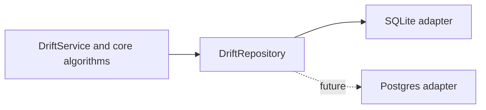

# Implementing a storage adapter

Drift is designed so that storage can change without changing graph behavior. A storage adapter is the implementation of the `DriftRepository` interface in `src/interfaces/repository.ts`. SQLite is the first adapter; a future Postgres adapter, for example, implements the same port and must preserve its observable behavior.

## The boundary

The core owns tenancy, authorization, optimistic concurrency policy, graph traversal, and declarative retrieval. An adapter owns persistence:

- map database rows to Drift records and records to storage values;
- execute repository reads, writes, transactions, and connected-edge lookups;
- apply that storage system's migrations and indexes; and
- translate storage-specific failures only when the repository contract requires it.

An adapter must not introduce a second definition of Drift rules. In particular, it must not implement traversal loops, retrieval projection/grouping/aggregation, scope checks, or API-key authorization policy.

## Required repository behavior

An adapter must implement every member of `DriftRepository`, including tenant and API-key persistence, vertex/edge CRUD, soft deletion/restoration writes, filtered list reads, and `findConnectedEdges`.

The port has two intentional shapes:

1. **Record operations** persist or retrieve one tenant-scoped record at a time. They use the supplied tenant ID and never infer it from client input.
2. **Persistence primitives** support core algorithms without embedding them. `findConnectedEdges` returns edges adjacent to a supplied frontier according to direction, edge-type, and deleted-record filters. Core traversal decides how often to call it, how to build the next frontier, and how to limit results.

List methods must preserve the documented filters, deterministic ID ordering, opaque cursor behavior, page boundaries, and deleted-record handling. Update and delete methods must honor the supplied version atomically, returning `null` when the expected active record/version does not match. The service translates that outcome into the public conflict response.

## Adapter-internal structure

An adapter may use direct SQL, a query builder, or an ORM. That is an implementation decision inside the adapter, not a change to the core boundary.

The SQLite adapter separates its own concerns:

- `repository.ts` translates `DriftRepository` calls to adapter components;
- `graph-store.ts` contains reusable SQL query mechanics;
- `mappers.ts` converts SQLite rows and patch fields; and
- `migrations.ts` creates tables and indexes.

A new adapter should use an equally clear internal structure. Do not expose its ORM models, SQL query objects, connection types, or migration APIs to `src/core` or `src/api`.

## Recommended implementation sequence

1. Read `DriftRepository`, `ARCHITECTURE.md`, and the SQLite adapter as the behavioral reference.
2. Add the adapter under `src/adapters/<storage>/` with its connection lifecycle, migrations, mappers, and repository implementation.
3. Implement tenant/API-key operations first so authentication works through the new adapter.
4. Implement vertex and edge reads/writes, including same-tenant lookup and atomic version-aware updates.
5. Implement filtered lists and `findConnectedEdges` as efficient storage queries with the appropriate tenant and active-record indexes.
6. Run the shared repository behavior tests against the new adapter. Add storage-specific integration tests for migrations, transactions, JSON representation, and indexes.
7. Verify the HTTP contract suite without changing core or route code.

## Compatibility checklist

Before an adapter is considered compatible, verify all of the following:

- tenant isolation applies to every read and write;
- API-key secrets remain hashed and are never returned from a lookup;
- JSON payloads round-trip as valid Drift `Json` values;
- IDs, timestamps, statuses, nullability, and versions map without loss;
- updates, soft deletion, and restore perform atomically with version checks;
- deleting a vertex and its active incident edges occurs in one transaction;
- active graph reads hide deleted records unless the caller explicitly requested deleted data;
- lists paginate deterministically and traversal's edge lookup respects its filters; and
- no adapter-specific type is imported by the core, contracts, or API layers.

When a second adapter exists, promote the existing SQLite integration scenarios into a reusable repository conformance suite so both adapters prove the same behavior.
