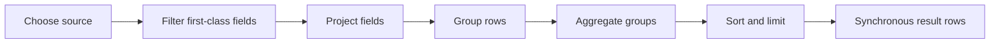

# Why retrieval is declarative

Use this explanation when deciding whether a client should list records, traverse relationships, or request a declarative aggregate. The distinction matters because retrieval is bounded and synchronous rather than a general query or job system.

Drift has three read methods with different jobs:

- lists retrieve resource collections with a small set of indexed filters;
- traversal follows bounded graph relationships; and
- retrieval summarizes vertex or edge records into a bounded result set.

Retrieval is optional from the client's perspective. A client uses it only when a list or graph walk would require unnecessary application-side aggregation.

## A constrained ETL/MapReduce process

`POST /v1/retrieve` is Drift's small, synchronous ETL/MapReduce-style read operation. It is not a general-purpose ETL runtime. A request describes the result it needs; Drift performs a bounded sequence of transformations inside the authenticated tenant and returns rows immediately.

The pipeline follows this order:



### 1. Choose one source

`source` is either `vertices` or `edges`. Drift never combines both sources in one retrieval request. The source is already constrained to the API key's tenant; normal requests also exclude soft-deleted records.

### 2. Filter first-class fields

The optional `filters` object narrows the selected source by `type`, `status`, or explicit IDs. Edge records are retrieved as edge records, not joined with their endpoints. An admin may request deleted records with `includeDeleted`; other keys cannot.

This is the extract part of the operation: select a bounded tenant-owned set of persisted records before shaping any result rows.

### 3. Project fields into rows

`projection` selects the fields each input record contributes to the pipeline. A projection entry has a source `field` and optional output name `as`.

```json
[
  {
    "field": "type"
  },
  {
    "field": "title",
    "as": "label"
  },
  {
    "field": "data.cost",
    "as": "cost"
  }
]
```

Top-level record fields may be projected. Explicit `data.*` and `metadata.*` paths may also be projected from flexible JSON. JSON paths are deliberately projection-only: they cannot filter, group, or join records in the MVP.

### 4. Group and reduce

`groupBy` names projected output fields. Without a `groupBy`, records remain individual rows unless aggregates are requested. With groups, Drift reduces each group using standard aggregate operators:

| Operator | Result                                                              |
| -------- | ------------------------------------------------------------------- |
| `count`  | Number of input rows in the group. It does not need a source field. |
| `sum`    | Sum of numeric values from a projected field.                       |
| `min`    | Lowest numeric value from a projected field.                        |
| `max`    | Highest numeric value from a projected field.                       |
| `avg`    | Arithmetic mean of numeric values from a projected field.           |

Each aggregate uses `as` to name its result. This is the MapReduce aspect of the endpoint: a record is mapped into a projected row, rows are partitioned by group keys, and each partition is reduced to aggregate values. The implementation does not expose executable map or reduce functions.

### 5. Sort, limit, and return

`sort` orders the final rows by projected field or aggregate name. `limit` caps returned rows. Drift also enforces non-negotiable server ceilings on input scan size, group count, result count, traversal depth, and traversal results. A client may ask for a lower bound, never a higher one.

The default ceilings are 5,000 scanned records, 1,000 groups, 1,000 returned rows,
and a 250 ms cooperative retrieval budget. Drift checks the budget between stages and
while processing records; it is a bounded synchronous request budget, not a general
purpose execution sandbox. Exceeding a ceiling returns `422 limit_exceeded`.

The response is synchronous and includes `rows` plus `scanned`, the number of source records considered. It does not write vertices or edges, save a dataset, create an event, or enqueue background work.

## Why it is not executable MapReduce

The endpoint accepts a small declarative pipeline rather than JavaScript map/reduce functions. This preserves the qualities Drift needs from an application chassis: tenant isolation is automatic, work can be bounded, results are portable across storage adapters, and behavior can be covered by contract tests.

There are no JSON-path predicates or grouping, joins, graph traversal inside a pipeline, custom code, asynchronous jobs, retry queues, or saved derived datasets. Those constraints prevent a convenience endpoint from becoming a second query language or a distributed compute system before Drift has proven the core model.
