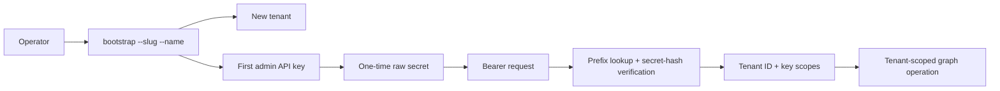

# Tenants, bootstrap, and API keys

Use this explanation when designing tenant provisioning or credential handling around Drift. API keys establish the tenant boundary for every graph request, while bootstrap is the operator-only action that creates the first boundary and the first credential that can manage it.

## The relationship



One successful bootstrap command creates exactly two persisted resources:

1. A **tenant**, identified internally by an ID and operationally by its unique `slug`.
2. The tenant's first **admin API key**, associated with that tenant ID and granted the `admin` scope.

The command output includes a raw key in the form `drift_<prefix>.<secret>`. The prefix identifies the stored key record; Drift hashes and verifies the secret. The raw secret is shown once only and is not stored in recoverable form.

When a client sends `Authorization: Bearer <raw-key>`, Drift verifies the key and derives its tenant ID and scopes. The client does not send `tenantId`, choose a tenant header, or gain access to records from another tenant by changing an ID in a URL or request body.

## Bootstrap creates a new tenant

Bootstrap is not a login command and it does not add another key to an existing tenant. It creates a new tenant each time it succeeds.

```bash
npm run cli -- bootstrap --slug acme --name "Acme Inc."
npm run cli -- bootstrap --slug northwind --name "Northwind Traders"
```

These commands create two isolated tenants and one separate initial admin key for each. An API key from `acme` cannot read or write `northwind` records.

The tenant slug must be unique. Running bootstrap again with `--slug acme` fails with a conflict and does not create a second tenant or replacement key. This protects an existing tenant from accidental reinitialization.

## Add keys to an existing tenant

Use the tenant's existing admin key to create additional credentials through `POST /v1/admin/keys`. This is the path for a client service key, a read-only reporting key, rotation, or revocation.

```json
{
  "label": "inventory-service",
  "scopes": ["read", "write"]
}
```

The resulting key remains bound to the same tenant as the admin key that created it. It cannot be reassigned to another tenant. See the [API reference](../reference/api.md) for the key-management routes and the [Docker guide](../how-to/docker.md) for the first bootstrap command.

## Operational guidance

- Store every raw secret in a password manager or deployment-secret store immediately.
- Use the initial admin key only for administration where practical; issue narrower `read` or `write` keys to services.
- Record the tenant slug alongside each secret so operators know which tenant it controls.
- Rotate or revoke a key through the tenant's admin API when a secret is exposed.
- Use bootstrap only to create a new tenant; reset a disposable local database if you need to restart an entire local environment.
